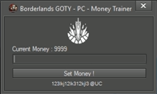

## # Borderlands-GOTY-Trainer :
Borderlands-GOTY-Trainer is a DotNet simple Borderlands Game Of The Year Edition Trainer with a few features such as :
* Adding your own amount of money.

**More features will be added.**

## Task List ( In order ) :

- [x] Money feature
- [ ] Golden Keys feature

## Developed by :
* Sehyn

## Credits : 
* erfg12

## Using Library :
https://github.com/erfg12/memory.dll

## Information :
* First of all thank you for downloading my source code.
* I Am fairly new to coding, I never had learning courses.
* Code may be a big mess for you, if this is the case apologies just trying to come up with something.
